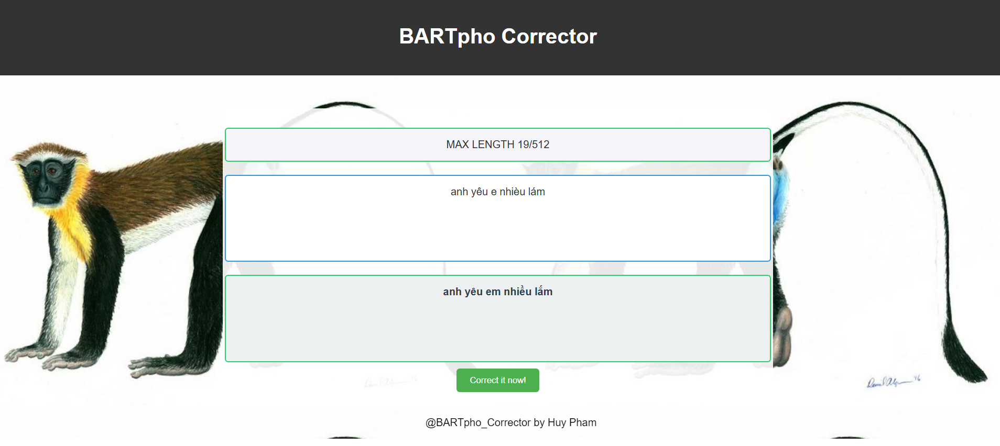

# BARTpho Corrector

**BARTpho Corrector** is a Vietnamese text correction tool built upon the **BARTpho** model. It is specifically fine-tuned for correcting text errors.

---

## Table of Contents
- [Introduction](#introduction)
- [Run the App](#run-the-app)
- [Fine-tuning BARTpho](#fine-tuning-bartpho)
  - [Data](#data)
  - [Training](#training)
- [Data Generator](#data-generator)
- [Future Work](#future-work)
- [License](#license)

---

## Introduction

BARTpho Corrector is a Vietnamese text correction tool that uses the **BARTpho** model fine-tuned for correcting text errors. It primarily targets Vpop-related texts, such as song lyrics, by utilizing a custom dataset that contains various types of text errors.

Key features include:
- An **interactive web application** for real-time text correction.
- **Notebooks** for managing the training process, allowing easy fine-tuning of the model.
- **A data generation notebook** to preprocess and structure your data into the correct format.
- The tool is customizable and extendable, making it suitable for other text correction use cases with additional fine-tuning.

---

## Run the App

### 1. Clone the Repository & Download the Model
First, clone the repository and download the fine-tuned BARTpho model from the following link:
```bash
git clone https://github.com/HuyPham235711/BARTpho_Corrector.git
cd BARTpho_Corrector
```
Download the model here:  
[Google Drive Model Link](https://drive.google.com/drive/folders/1dhGEi-YjOBF6DopI-uSobtqciZp7tN5b?usp=sharing)

Once downloaded, extract the files and place them in the `saved_model` folder.

### 2. Set Up the Environment
Create and activate a virtual environment:
```bash
python -m venv BARTpho_venv
BARTpho_venv\Scripts\activate  # On Windows
source BARTpho_venv/bin/activate  # On macOS/Linux
```

Install the required dependencies:
```bash
pip install -r requirements.txt
```

### 3. Run the Application
To start the application, run:
```bash
python app.py
```
Once the app is running, you should see the following message in your terminal:
```
* Running on http://127.0.0.1:5000/ (Press CTRL+C to quit)
```

### 4. Access the Web Interface
Open your browser and go to:  
[http://127.0.0.1:5000](http://127.0.0.1:5000)

You should see the web interface for real-time text correction.



---

## Fine-tuning BARTpho

### Data
- The dataset used for training was collected from various sources, primarily **Vpop song lyrics**.
- The model is specifically fine-tuned for correcting errors in texts related to Vpop, but it can be adapted for other use cases with additional training.
  
**Example of the data format:**
| Column Name | Type |
|-------------|------|
| original    | str  |
| error       | str  |

### Training
- Fine-tuning was performed using **Google Colab** with the **Hugging Face `transformers`** library.
- **Key training parameters:**
  - **Epochs**: 10
  - **Evaluation Steps**: Every 1500 steps
- The resulting model is optimized for correcting Vpop-related text errors but can be further fine-tuned for other domains as needed.

---

## Data Generator

You can create your own training data by following the format above. For detailed instructions on how to preprocess and structure your data, refer to the **`datagen.ipynb`** file in the repository. This notebook provides utilities to help generate and preprocess data into the required format for training.

---

## Future Work

Here are some potential improvements and future directions for the project:
- **Automated pipeline** for text correction, streamlining the correction process from input to output.
- Expanding the dataset to include diverse domains beyond Vpop, such as general Vietnamese text errors.
- **Optimizing the model** for real-time correction in production environments, ensuring faster response times and better scalability.
- **Deployment on cloud platforms** like AWS, Google Cloud, or Heroku for wider accessibility and real-world use.

---

## License

MIT License

Copyright (c) 2021 VinAI

Permission is hereby granted, free of charge, to any person obtaining a copy of this software and associated documentation files (the "Software"), to deal in the Software without restriction, including without limitation the rights to use, copy, modify, merge, publish, distribute, sublicense, and/or sell copies of the Software, and to permit persons to whom the Software is furnished to do so, subject to the following conditions:

The above copyright notice and this permission notice shall be included in all copies or substantial portions of the Software.

THE SOFTWARE IS PROVIDED "AS IS", WITHOUT WARRANTY OF ANY KIND, EXPRESS OR IMPLIED, INCLUDING BUT NOT LIMITED TO THE WARRANTIES OF MERCHANTABILITY, FITNESS FOR A PARTICULAR PURPOSE AND NONINFRINGEMENT. IN NO EVENT SHALL THE AUTHORS OR COPYRIGHT HOLDERS BE LIABLE FOR ANY CLAIM, DAMAGES OR OTHER LIABILITY, WHETHER IN AN ACTION OF CONTRACT, TORT OR OTHERWISE, ARISING FROM, OUT OF OR IN CONNECTION WITH THE SOFTWARE OR THE USE OR OTHER DEALINGS IN THE SOFTWARE.
